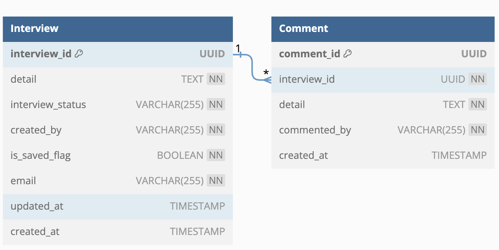

# Interview Service

Tools utilized in this service:
1. NestJS
2. TypeORM
3. Docker

Database: PostgreSQL

## Database schema


The Interview Table consists of the following attributes:

1. interview_id (uuid) for the primary key
2. detail (text) for interview details
3. created_by (varchar) to indicate the interview creator
4. is_saved_flag (boolean) to indicate whether the interview is saved or not
5. interview_status (varchar) to indicate the status of the interview, including ["To Do","In Progress","Done"]
6. email (varchar) to indicate the creator's email
7. updated_at (timestamp) to indicate the timestamp of the interview update
8. created_at (timestamp) to indicate the timestamp of the interview creation


The Comment Table consists of the following attributes:

1. comment_id (uuid) for the primary key
2. interview_id (uuid) as a foreign key related to the interview table
3. detail (text) for comment details
4. commented_by (varchar) to indicate the comment creator
5. created_at (timestamp) to indicate the timestamp of the comment creation

## Setup Project's docker container
Prerequisite: Have Docker installed.

### 1. Run the Docker Compose file to build and run both PostgreSQL and the API service.

```bash
$ docker-compose up -d
```

### 2. PostgreSQL database runs on port 5432.

username:postgres
password:postgres
database:interview

### 3. Interview service APIs run on port 80.

### 4.  All API documentation is described in SWAGGER UI.

Launch Swagger ui at : [SWAGGER_UI] (http://localhost/api)


## Setup Project Development

Prerequisite: Have Node.js and Docker installed.

### 1. Use Node.js version 18.14.2

```bash
$ nvm use 
```

### 2. Install dependencies

```bash
$ npm install
```

### 3. Run docker-compose (if docker container is not run yet)

```bash
$ docker-compose up -d
```

### 4. Run Project

```bash
$ npm run dev
```

### 5. The development server runs on port 8000.


